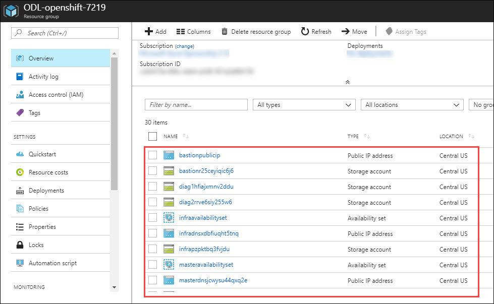

 ## Lab 01: Introduction to Azure Portal
 - [Using Preconfigured Environment](#using-preconfigured-environment)
   * [Exercise 01: Sign Up for Pre-configured Environment](#exercise-01-sign-up-for-pre-configured-environment)
   * [Exercise 02: Log into your Azure Portal and Verify access to the Subscription](#exercise-02-log-into-your-azure-portal-and-verify-access-to-the-subscription)
  
### Lab Overview
This lab will take you through Azure login and portal experience and the pre-requisite environment.


### Prerequisites
-	Windows or a Mac machine with HTML5 supported browser such as Microsoft Edge, Internet Explorer, Chrome or Firefox
-	Red Hat Customer Portal login credentials so that the Azure instances can be registered with Red Hat Subscription Manager properly, and you must have enough OpenShift Container Platform entitlements to cover the chosen configuration.


### Using Preconfigured Environment

### Time Estimate

10 minutes

### Exercise 01: Sign Up for pre configured environment

In this exercise, you will create a source environment.
1.	**Navigate** to training portal https://experience-azure.azurewebsites.net and register by providing all required information and **clicking** on **SUBMIT button**.


2. Once registration is accepted, you will be automatically redirected to the lab activation page. Now, it is advised to save a copy of the URL on the browser, which has the activation id. **Click** on the **Launch Lab** button.


3. You will see the environment details soon below.

Please ensure to take the values assigned to your deployment.


### Exercise 02: Log into your Azure Portal and Verify access to the Subscription

In this exercise, you will log into the **Azure Portal** using your Azure credentials and you will verify the type of role you are assigned in this Subscription.
1.	**Launch** a browser in InPrivate/Incognito mode and **Navigate** to https://portal.azure.com. Provide the credentials that you received via email. Click on **Sign In**.


```
Note : At the first login, you may have to change the password, if asked for.
```

2.	**Enter** a new **password**. Then select **Update password and sign in**.


3.	Now, you will be directed to the **Azure Dashboard**


4. **Click** on **Microsoft Azure** at the top left corner of the screen, to view the Dashboard.


5.	To toggle **show/hide** the Portal menu options with icon, **Click** on the **Show Menu** button. 


6.	**Click** on the **Resource groups** button in the **Menu navigation** bar to view the **Resource groups** blade.

"

7.	You will see a **Resource Group** which you have access to, **click** on it.


```
Note:
The Resource Group shown here is for demo purpose only. Actual name of the Resouce Group that you see may differ.
```

8. In the **Resource Group** blade that come up, you can see the deployed resources.



9.	From the **Resource Group** blade, **Select** the Access Control ( IAM ) which is on the left side of the blade.


10. In the new blade that come up, you can see the **role** that is assigned to you.


Now, goto next lab.

[Next>](/docs/Lab%2002:AccessingOCP.md)


