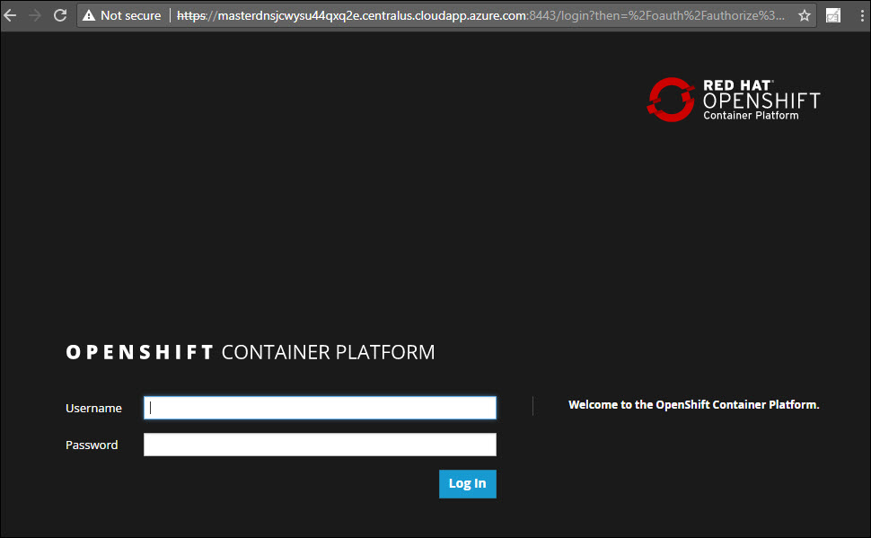

## Lab 02: Accessing OpenShift Console

 
### Lab Overview
In this lab, you will access the Openshift Console of the already deployed cluster
### Prerequisites
*	Lab 01 must be completed

### Time Estimate
2 minute

### Exercise 01: Accessing Openshift Console

1.	Now to login to *OpenShift console*, **Open** a new tab in the browser and **paste** the **OpenShift Console URL** which you received via email.
```
Note: Skip the certificate warning
```


2.	 Provide the credentials you received via email over there and click on **Login**.

3.	Once the login is **successful**, you will be redirected to the **OpenShift console**.


[<Previous](/docs/Lab01:GettingStarted.md) /
[Next>](/docs/Lab03:IntegrationwithAAD.md)
