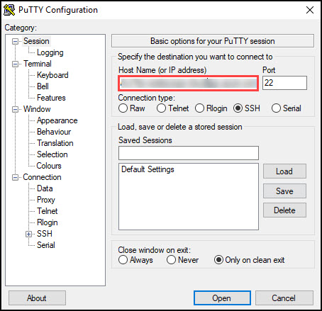
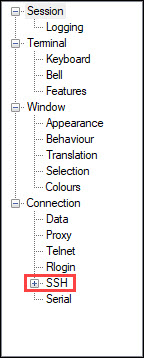
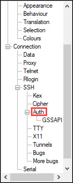
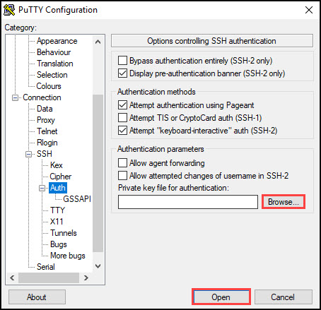
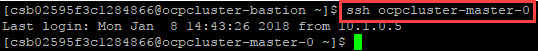
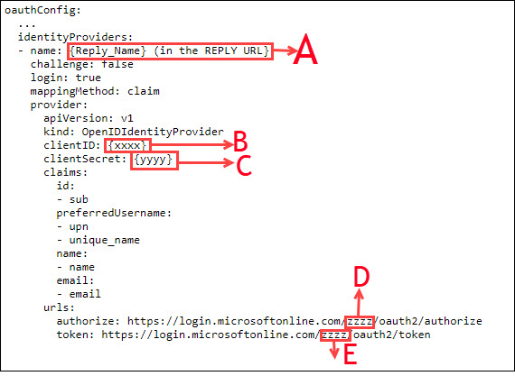
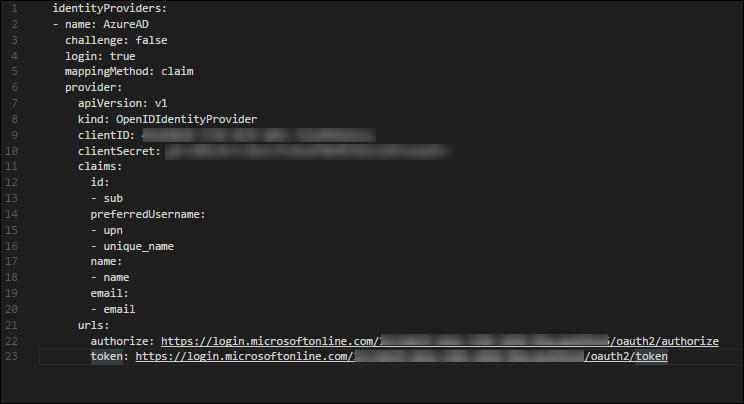
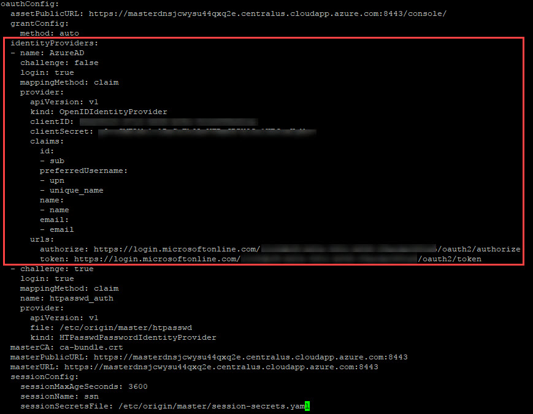
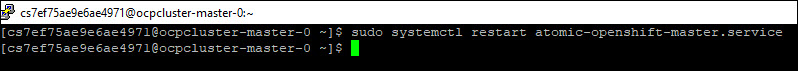

## Lab 03: Azure AD Integration

* [Exercise 01: Create an Azure AD Application](#exercise-01-create-an-azure-ad-application)
* [Exercise 02: Configure Azure AD Authentication](#exercise-02-configure-azure-ad-authentication)


### Lab Overview
In this lab, you will configure **Azure AD Authentication** in **OpenShift** .
### Prerequisites
*	Lab 02 must be completed

### Time Estimate
120 minutes

### Exercise 01: Create and Configure Azure AD Application
In this exercise, you will create an Azure AD App and retrieve the Client ID and Client secret values.
1.	**Launch** a browser and **Navigate** to https://portal.azure.com. **Login** with the Microsoft Azure credentials you received via email.


2.	**Click** on the **Azure Active Directory** button in the **Menu navigation** bar to view the **Azure Active Directory** blade.


3.	You will be directed to the Azure Active Directory blade, **click** on **App registrations**.


4.	In the next blade, **click** on **New Application Registration** on top of the blade.


5.	In the **Create** blade, **configure** as follows:

-	Name: **(Provide a unique value)**
-	Application type: **Web app/API**
-	Sign-on URL: https://contoso.com

```
Note: We will change this value later during the lab.
```

And then **click** on **Create**.


6.	You will be redirected to the **App registrations** blade. You can check the app has been created by typing the App Name in the search field.


If the app has been created, you can see it in the results as shown above.

7.	Click on the **app** you **created** and you will be directed to the App blade.

8.	Copy the **Application Id** and **save** it in a notepad or any text editor for later use.


9.	Now, **Click** on **Keys** in the settings blade.


10.	In the **Keys** blade, **configure** as follows:

- Description: **key1**
- Expires: **Never expires**

And **Click** on **Save.**


11.	After you click on save, the **key value** will be displayed which is the Client Secret.
**Copy** the value into the text editor where you saved the value of **Application Id** for later use.


12.   Now go back to the setting blade of the App and Click on **Required permissions**.


13.   Click on **Grant Permissions** in the blade that come up and then **Click** on **Yes**


14.   Now go back to the setting blade of the App and Click on **Properties** under Settings blade.


15.	In the **Properties** blade, **edit** as follows:
-	App ID URI: (Provide the OpenShift Console URI)
-	Home Page URL type: (Provide the OpenShift Console URI)
And then **click** on **Save**.


16.	Once you save the **properties**, close the properties blade.


17.	Then you will be **redirected** to the Settings Blade of **AD App**. Click on the **Reply URLs**.


18.	Now **modify** the OpenShift console **url** by removing the ‘console’ from the end and appending **‘oauth2callback/AzureAD’** to the url and provide it in the Reply URL blade that come up and then Click on Save. 


### Exercise 02: Configure Azure AD Authentication

1.	Using putty and the DNS Name of Bastion VM you received via email , Connect to the VM.

2. Download Putty from here. http://www.chiark.greenend.org.uk/~sgtatham/putty/download.html

23. Now run putty.exe from you PC

4. Enter the following to the Host Name (or IP address) box of the putty.
```
ocpadmin@<DNSNameofBastionVM>
```


```
Note: Substitute in the above command with the value of DNS Name of Bastion VM you received via mail 
```

5. Now expand the SSH setting on the left side of the putty by clicking on **+SSH**. Then Select **Auth** 





6. Then click on **Browse** and select the private key which you received via email and click on **Open**



7. Now a new terminal will pop and you will be connected to the Bastion VM. The PuTTY Security Alert will pop up. Click on Yes.

8.	Now **execute** the following command. 
```
ssh ocpcluster-master-0
```


9. Now open a new tab in a browser and go to https://raw.githubusercontent.com/SpektraSystems/openshift-container-platform/master/aadAuth.conf. Copy the contents to a text editor and edit the file and provide the following:
- A. Type **AzureAD** after removing other text
- B. Application Id of the app created before
- C. Client Secret of the App created before 
- D. Tenant ID you received via email
- E. Tenant ID you received via email



10. Now **execute** the following command in the putty session. 
```
sudo vi /etc/origin/master/master-config.yaml
```


11. Now copy the edited content from identityProviders to the end of the file and open the existing putty session you are using and type '**/identity**' and hit enter. You will be directed to line starting with identityProviders. 
Now type **i** to enter Insert Mode. 

12. Keep the pointer at the starting of identityProvider word and press "**delete**" button until "identityProviders:" is deleted(Make sure to not delete the line) and then paste the edited content by right clicking. Then press "**Escape**" button and type '**:wq!**' and hit enter.



```
Note: Make sure you don't change the indentation of the contents while copying or pasting, else the setup will fail
```

13. Now **execute** the following command. 
```
sudo systemctl restart atomic-openshift-master.service
``` 


14. Now to verify that the user is able to **authenticate** to OpenShift console via Azure AD, **Open** a new tab in the browser and **paste** the **OpenShift Console URL** you received via email.
```
Note: Skip the certificate warning
```


15.	Now click on **AzureAD**, you will be redirected to the **Login Page**. Provide the Azure credentials you received via email over there and click on **Sign in**.


16.	Once the login is **successful**, you will be redirected to the **OpenShift console**.


[<Previous](/docs/Lab02:AccessingOCP.md) /
[Next>](/docs/Lab04:DeployingWorkloadonOpenshift.md)
